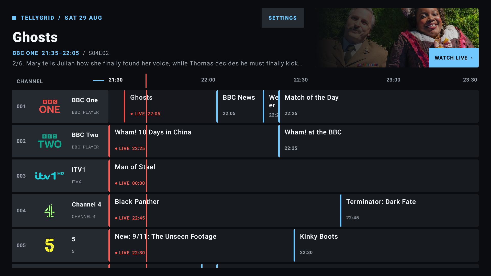
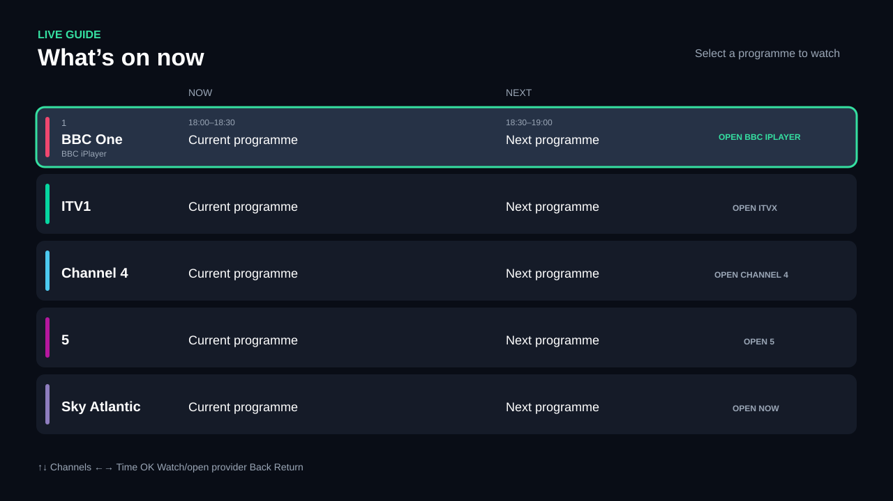

# TellyGrid

**One live TV guide. Every app.**

[](https://github.com/lozza/TellyGrid/actions/workflows/android.yml)
[](https://github.com/lozza/TellyGrid/actions/workflows/guide.yml)



## Download

[Download the newest TellyGrid alpha for Android TV](https://github.com/lozza/TellyGrid/releases)

This first public build is a sideloading preview signed with a development key. A
future production-signed release may require the preview to be uninstalled first.
See [all releases](https://github.com/lozza/TellyGrid/releases) for release notes and
newer builds.

TellyGrid is a source-available guide-and-launcher for Android TV/Google TV. It presents BBC, ITV,
Channel 4, 5, NOW, and discovery+ channels in one remote-friendly screen. Selecting
a broadcaster channel opens the provider's installed app. The same architecture can
play a stream in-app only when the product owner has explicit distribution rights,
an authorised manifest, and any required DRM licence integration.

The APK now contains a two-day Sky UK XMLTV snapshot generated with the selected
`iptv-org/epg` tool. If that snapshot has expired and no hosted feed is configured,
the app clearly falls back to illustrative data. It contains no broadcaster stream
URLs, credentials, tokens, or copied logos.

The app refreshes from `https://lozza.github.io/TellyGrid/guide.xml`. GitHub Actions
regenerates and publishes that guide twice daily; the bundled copy keeps the app
usable during a temporary GitHub or source outage.

## Feasibility

| Provider/content | Unified guide | MVP playback | Direct playback in this app |
|---|---:|---|---|
| BBC One/Two/etc. | Yes, with licensed EPG metadata | Open BBC iPlayer | Only with a BBC distribution agreement and authorised stream/DRM integration |
| ITV1/2/3/4 | Yes | Open ITVX | Only with an ITV agreement |
| Channel 4/E4/More4 | Yes | Open Channel 4 | Only with a Channel 4 agreement |
| 5/5STAR/5USA/etc. | Yes | Open 5 | Only with a Channel 5 agreement |
| NOW/Sky channels | Yes, respecting membership | Open NOW | Only through a commercial Sky/NOW partner integration |
| discovery+ channels | Yes, respecting plan/territory | Open discovery+ | Only through a Warner Bros. Discovery partner integration |
| Your own/licensed FAST channels | Yes | In-app Media3 player | Yes: HLS/DASH and optional Widevine fields are scaffolded |

Official sources confirm that these services offer live content and Android/Android
TV support in at least some configurations. Availability still varies by television
model, certification, region, subscription and app-store catalogue. BBC iPlayer in
particular must be tested on every target device family rather than assuming all
generic Android TV boxes are supported.

TellyGrid discovers TV-launchable apps and handlers for official broadcaster URLs,
including manufacturer-supplied Freeview Play variants. `APP SETUP` lets the user
override automatic matching for each provider. A channel URL is sent only to the
chosen installed app when Android reports that app can handle it; app-home launch is
the fallback. Exact tuning remains provider/device dependent and requires physical-TV
testing.

## UX blueprint

The scaffold implements the first useful slice:



- A ten-foot `LIVE GUIDE` screen with channel number/name, provider or membership
  badge, current programme, next programme and a clear destination label.
- Up/down moves between channels. Select opens the programme. Focus has a high-
  contrast border and does not depend on colour alone.
- The launch order is supported channel link, selected TV app, then automatically
  detected TV app. It never redirects a Freeview Play TV to an incompatible retail
  Play Store build. Returning from the provider app returns to the guide.
- A licensed stream opens a full-screen Media3 player; Back returns to the guide.

The production version should add horizontal time navigation in 30-minute steps,
date jump, favourites, genre/provider filters, regional variants, search, reminders,
and sign-in/subscription state. Preserve row and time position when a user returns
from another app.

| Remote action | Result |
|---|---|
| Up / Down | Previous / next channel |
| Left / Right | Earlier / later programme |
| Select | Watch directly or show `Opening <provider>` and hand off |
| Long-select | Programme details, favourite, reminder |
| Back | Details → guide → Android TV home; player → guide |
| Play/Pause | Controls only an in-app licensed stream |

## Architecture

```text
Licensed EPG/API -> backend normaliser/cache -> GuideRepository -> Compose guide
                                                          |
                                                PlaybackTarget
                                                /            \
                           authorised HLS/DASH + DRM       Provider handoff
                                     |                           |
                               Media3 player              Intent / Play Store
```

Important boundaries:

- Fetch and normalise EPG data on a backend. Use a licensed metadata supplier or
  direct provider feed; do not scrape programme sites or embed third-party secrets.
- Backend output should include channel/region IDs, UTC times, metadata rights,
  entitlement hints and an opaque playback target ID. The client should never
  manufacture broadcaster stream URLs.
- Keep provider packages, verified deep links, kill switches and minimum app versions
  in signed remote configuration.
- Treat direct playback as a server-authorised capability. Media3 supports Widevine,
  but technical DRM support does not grant content rights.
- Authentication stays inside provider apps. Do not collect provider credentials.

## Project map

- `data/GuideModels.kt`: channel, programme, provider and playback target model.
- `data/ProviderRegistry.kt`: replaceable app-launch identifiers.
- `data/SampleGuideRepository.kt`: illustrative now/next data; replace with API data.
- `playback/TvAppDiscovery.kt`: installed TV-app and official-URL handler discovery.
- `playback/AppHandoffLauncher.kt`: supported channel link → selected/detected app fallback.
- `ui/ProviderSetupScreen.kt`: D-pad provider-to-app mapping for OEM/Freeview Play builds.
- `ui/GuideScreen.kt`: D-pad-first Compose guide.
- `ui/PlayerScreen.kt`: Media3 HLS/DASH/Widevine entry point for licensed streams.
- `PlaybackSafetyTest.kt`: prevents sample broadcasters becoming direct streams.
- `docs/epg-api-contract.md`: proposed production API and provider-config boundary.

## Open and run

1. Install Android Studio with Android SDK 35 and use Android Studio's bundled JDK.
2. Open this folder as the project and let Gradle sync.
3. Create an Android TV emulator, or connect a supported physical Google TV/Android
   TV device with developer mode enabled.
4. Run the `app` configuration. Install provider apps to exercise the handoff. They
   may be unavailable on an emulator because of territory/device certification.
5. Run the unit test before changing provider playback routes.

The Gradle wrapper is included. On 27 August 2026, the project successfully ran the
unit tests and produced a debug APK using the Android Studio installation and SDK on
this computer. The ready-to-install build is at `dist/unified-guide-debug.apk`.

The app has also been installed and checked on an API 34 Android TV emulator at
1920×1080, including D-pad focus navigation. A physical Android 11 TV remains the
next compatibility test, especially for installed broadcaster-app handoffs.

## Sky UK guide updates

`epg/sky-uk.channels.xml` is the curated lineup: the main terrestrial channels,
NOW Entertainment/Cinema/Sports channels (including U&Gold, U&Alibi, MTV, Comedy
Central, Sky Kids and Sky Mix), and discovery+ channels. It avoids the
duplicate regions and non-UK services in Sky's full list.

To generate a fresh two-day guide and place it in the Android app assets, run:

```powershell
.\scripts\update-sky-guide.ps1
```

The script downloads a pinned revision of `iptv-org/epg`, installs its Node.js
dependencies, and queries its `sky.com` configuration. The generated
`app/src/main/assets/sky-guide.xml` is a build-time fallback, so regenerate it before
creating an APK.

For automatic daily data, host the generated `guide.xml` over HTTPS and build with:

```powershell
.\gradlew.bat assembleDebug -PEPG_URL=https://your-server.example/guide.xml
```

At startup the app tries that URL, caches a successful response, then falls back to
the last saved or bundled guide. Run the grabber on a server once or twice daily;
do not run the Sky scraper on every television.

The EPG project's Unlicense covers its source code, not necessarily Sky's underlying
programme metadata, images or trademarks. Confirm permission and applicable terms
before distributing an app or republishing the generated listings commercially.

## Practical delivery plan

### Phase 0 — commercial and device proof (1–2 weeks)

- Choose launch territories and a device matrix (for example Chromecast with Google
  TV, Google TV Streamer, NVIDIA Shield, and selected Sony/Philips/TCL televisions).
- Obtain written EPG/logo usage rights. Ask each provider for its Android TV package,
  supported App Link/channel URI, attribution and certification requirements.
- Test automatic and manual app matching, channel URLs and app-home fallback on each
  physical TV family. Treat exact tuning as unavailable until it passes that test.

### Phase 1 — guide launcher MVP (3–4 weeks)

- Build the EPG normalisation/cache service and regional lineup endpoint.
- Replace samples; add timeline navigation, loading/offline states, favourites,
  remote configuration, accessibility and basic telemetry.
- Ship an internal test build with app-level handoff only.

### Phase 2 — beta quality (2–3 weeks)

- Add account-free onboarding (region, favourites, provider availability), reminders,
  search, parental metadata and robust time-zone handling.
- Test cold starts, Back/focus restoration, missing apps, expired subscriptions,
  network loss, 720p/1080p/4K displays and TalkBack.
- Complete privacy, TV Licence wording, store assets and Android TV quality checks.

### Phase 3 — deeper integrations (provider-dependent)

- Add provider-issued channel deep links behind per-device feature flags.
- Add in-app Media3 playback only for owned/licensed channels, including entitlement,
  geo controls, Widevine, advertising rules, captions and audio description.
- Consider Google TV Live tab integration only after meeting its partner and
  frictionless-playback requirements.

## Release gates

- No broadcaster manifest URL appears in source, sample data, logs or analytics.
- Every EPG field, logo and image has documented redistribution rights.
- Every deep link is provider-approved, tested, remotely disableable and has an app-
  home/store fallback.
- Users are told when selection leaves the guide and if a subscription is needed.
- Live-TV/BBC iPlayer TV Licence messaging is reviewed for a UK launch.
- Legal/content-rights review is complete before public distribution.

## References checked 27 August 2026

- [Android TV app setup and Compose recommendation](https://developer.android.com/training/tv/get-started/create)
- [Android TV navigation and Live tab requirements](https://developer.android.com/training/tv/get-started/navigation)
- [Android deep-link routing](https://developer.android.com/training/app-links/create-deeplinks)
- [Package-visibility launch guidance](https://developer.android.com/training/package-visibility/use-cases)
- [Media3 DRM support](https://developer.android.com/media/media3/exoplayer/drm)
- [ITVX supported TV platforms](https://help.itv.com/support/solutions/articles/204000073719-which-tvs-and-streaming-platforms-can-i-watch-itvx-on-)
- [5 supported devices](https://help.channel5.com/hc/en-gb/articles/206668809-How-can-I-access-My5)
- [NOW on Android TV](https://www.nowtv.com/gb/help/article/android-tv)
- [BBC iPlayer live-TV listing](https://play.google.com/store/apps/details?id=bbc.iplayer.android)
- [Channel 4 live-TV listing](https://play.google.com/store/apps/details?id=com.channel4.ondemand)
- [5 live-TV listing](https://play.google.com/store/apps/details?id=com.mobileiq.demand5)
- [discovery+ Android listing](https://play.google.com/store/apps/details?id=com.discovery.dplay)
- [UK TV Licence scope](https://www.tvlicensing.co.uk/check-if-you-need-one)
