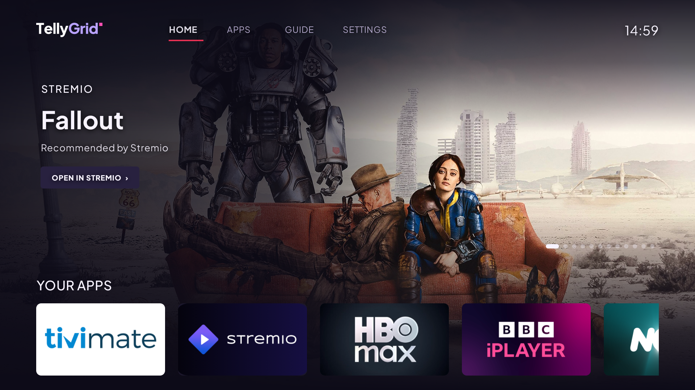
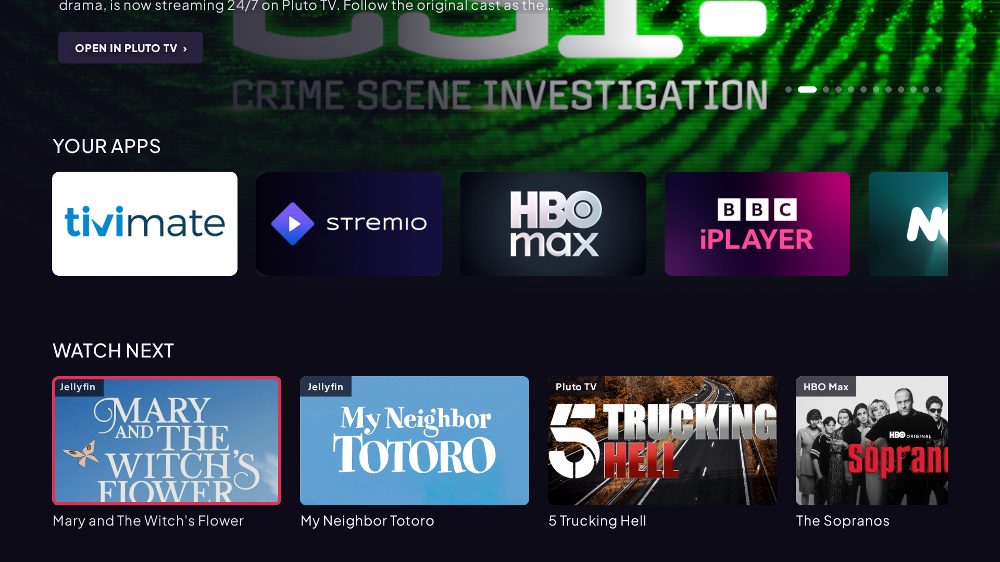
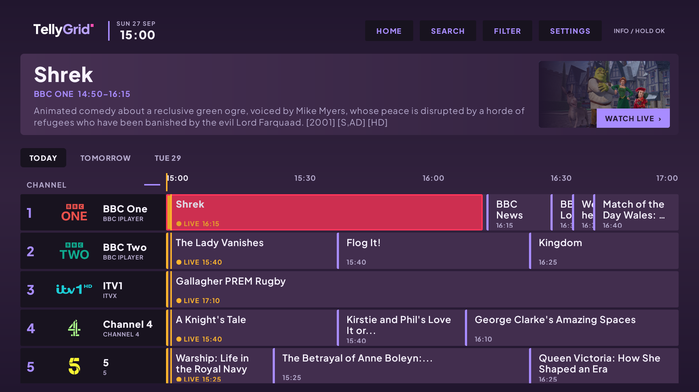
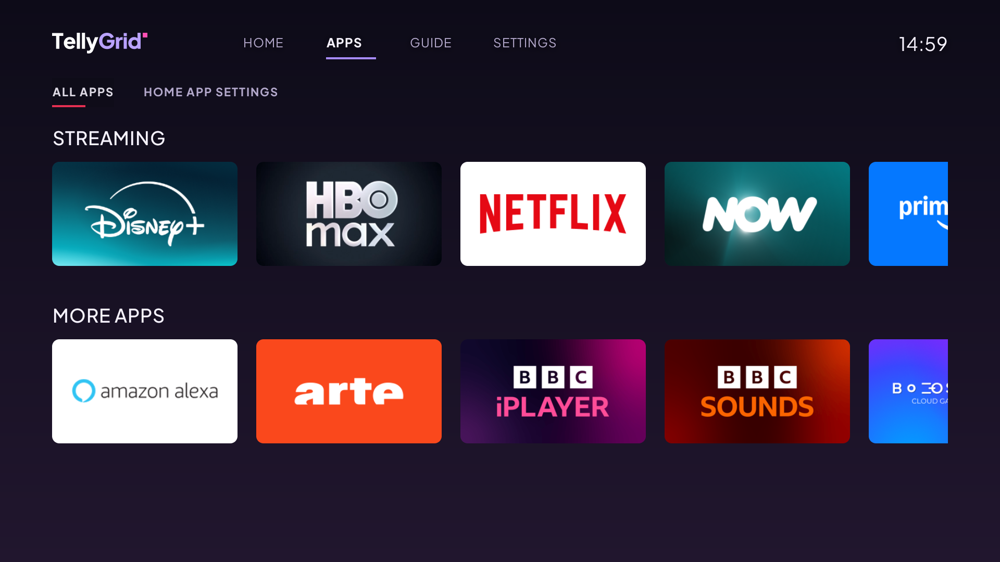
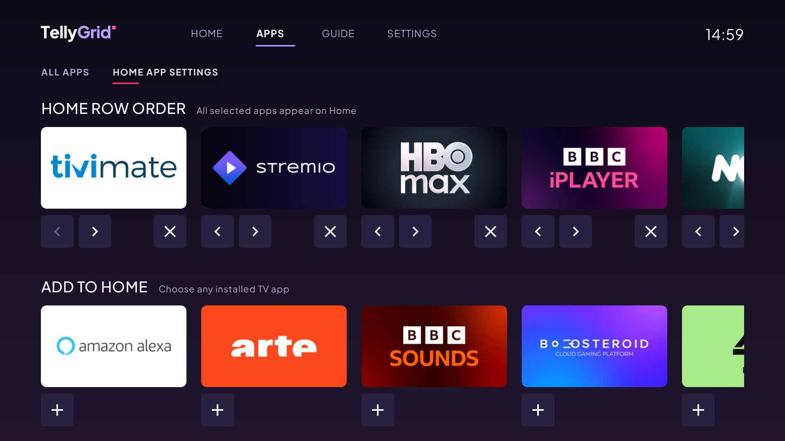
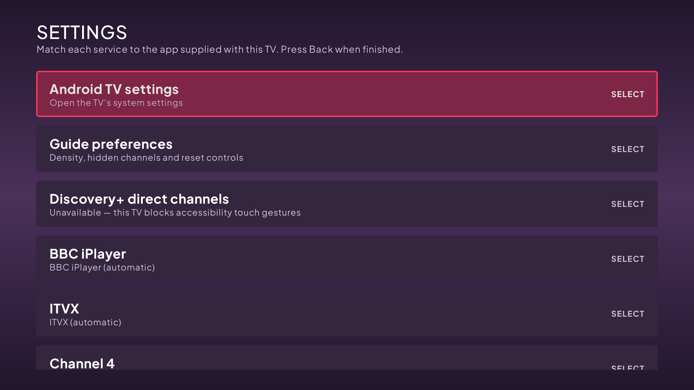

# TellyGrid

For the current development state, verified TV results and next tasks, see [the 27 September 2026 handoff](docs/HANDOFF-2026-09-27.md).
The newest changes are summarised under [What's new in alpha 7](#whats-new-in-alpha-7).

**One live TV guide. Every app.**

[](https://github.com/lozza/TellyGrid/actions/workflows/android.yml)
[](https://github.com/lozza/TellyGrid/actions/workflows/guide.yml)



| Home rows | Guide |
| --- | --- |
|  |  |
| **Apps** | **Home app settings** |
|  |  |
| **Settings** | |
|  | |

## What's new in alpha 7

Checked on the reference Philips Android 11 TV on 27 September 2026.

- **Home looks like a broadcaster's launcher.** A full-width banner rotates every 8 seconds
  through app recommendations, BBC iPlayer picks, recently watched titles and one live
  programme, with the artwork running behind the menu. Left/Right on its button skips
  between picks, and it opens that title in its app. Larger artwork is requested from
  known image CDNs so the banner stays sharp.
- **Watch next is ordered by what you watched last** (it previously showed the oldest
  12 entries), and **Apps → Home app settings → Watch next apps** chooses which apps may
  add to it.
- **BBC iPlayer row** of popular episodes that open the exact episode (from the BBC
  iPlayer thread's change), plus a crash fix for provider handoffs that also affected
  the guide.
- **Faster artwork.** Jellyfin pictures are fetched resized from the Jellyfin server
  rather than through its slow TV image provider, and all artwork is cached on disk.
- **Pluto TV channels work again.** Pluto 17 (Paramount build, 23 Sept 2026) rejected the
  old web route; TellyGrid now sends `plutotv://live-tv/<channel id>`.
- **discovery+ opens the live channel** for Discovery, TLC, Quest, Investigation
  Discovery, Quest Red, Animal Planet, Food Network, DMAX, Really, Discovery Science,
  Discovery Turbo and Discovery History, using
  `https://play.discoveryplus.com/channel/watch/<channel>/<edit>` links. HGTV was removed
  because the UK app does not carry it.
- **Home live TV cards open the channel** the same way the guide does (TV tuner for
  Freeview channels). Freeview channels such as Sky Mix no longer appear on the NOW row,
  and the "Ones to watch" row is gone.
- **New look:** Plus Jakarta Sans throughout (SIL OFL, see `docs/PlusJakartaSans-OFL.txt`),
  a new TellyGrid wordmark and Android TV banner/icon, one shared style for Settings,
  Guide filters, Guide preferences and Search, consistent spacing, and icon buttons on
  Home app settings.
- **Remote fixes:** Back on the guide returns to TellyGrid Home; the guide's day tabs
  always move to/from the selected day and programme; Home rows scroll fully into view.

## Download

[Download the newest TellyGrid alpha for Android TV](https://github.com/lozza/TellyGrid/releases)

This first public build is a sideloading preview signed with a development key. A
future production-signed release may require the preview to be uninstalled first.
See [all releases](https://github.com/lozza/TellyGrid/releases) for release notes and
newer builds.

TellyGrid is a source-available guide-and-launcher for Android TV/Google TV. It presents BBC, ITV,
Channel 4, 5, NOW, and discovery+ channels in one remote-friendly screen. On devices
with compatible retail BBC iPlayer or ITVX apps, BBC One-Four and ITV1-4 are handed
their provider-owned live-channel links. Manufacturer Freeview wrappers that cannot
handle those links use the exact local tuner instead, so one Back press returns to
the guide. Other channels hand off to the provider's installed app. The same
architecture can
play a stream in-app only when the product owner has explicit distribution rights,
an authorised manifest, and any required DRM licence integration.

The APK now contains a two-day Sky UK XMLTV snapshot generated with the selected
`iptv-org/epg` tool. If that snapshot has expired and no hosted feed is configured,
the app clearly falls back to illustrative data. It contains no broadcaster stream
URLs, credentials, or tokens. Channel identity artwork is resized and bundled with
the APK, so rows do not depend on third-party image hosts at runtime; every logo also
has a text fallback.

The app refreshes from `https://lozza.github.io/TellyGrid/guide.xml`. GitHub Actions
regenerates and publishes that guide twice daily; the bundled copy keeps the app
usable during a temporary GitHub or source outage.

Alpha 6 adds device-aware BBC and ITV routing. A selected or detected retail iPlayer/
ITVX app gets first refusal on the provider's live-channel link; Philips Freeview
wrappers retain reliable exact-tuner playback. The catalogue contains 82 channels.
Its Freeview section includes the main
BBC, ITV, Channel 4, 5, U and discovery-owned terrestrial services. The NOW rows use
device-verified channel links for Entertainment, Kids, Cinema and Sports, including
the current Sky One lineup. The discovery+ catalogue includes the 12 live
entertainment channels in the UK discovery+ TV app, each with a device-verified
live-channel link.

The sports section also includes TNT Sports 1–4 using Sky listings and an HBO Max
handoff. HBO Max officially lists those four UK linear channels, but TellyGrid has
not verified channel-specific HBO Max links or playback with an active subscription;
selecting one therefore opens the installed HBO Max TV app.

### discovery+ live channels

The discovery+ Android TV app (21.12) plays `https://play.discoveryplus.com/channel/watch/<channel-uuid>/<edit-uuid>`
links directly. The UK UUIDs were copied from the discovery+ website and each opened the
live channel on the reference TV; they live in `playback/DiscoveryChannelAutomation.kt`.

### Optional discovery+ channel control (fallback)

Older builds of the discovery+ Android TV app did not accept per-channel links. TellyGrid
still includes an experimental, optional Accessibility Service that can open discovery+
Browse and tap the chosen live-channel tile only on devices with a touchscreen input
source. The first-run disclosure explains the behaviour and shows the manual TV-settings
path; the user must enable the service themselves. It is off by default and can be
disabled at any time.

Typical Android TV path: **Settings → Device Preferences (or Android settings) →
Accessibility → TellyGrid discovery+ channel control → Enable**. On Philips TVs, start
at **Settings → Android settings → Device Preferences → Accessibility**. Menu names can
vary by manufacturer.

Standard non-touch Android TVs cannot use this route: Android only dispatches accessibility
gestures to a touch input pipeline, discovery+ 21.10.0.73 exposes no actionable accessibility
nodes, and accessibility services cannot inject D-pad keys. TellyGrid detects the missing
`android.hardware.touchscreen` feature, skips automation, and opens discovery+ normally.

The service is package-restricted to `com.discovery.dplay`, requests gesture capability
but not accessibility-node retrieval, and neither reads nor records screen content. It
runs a short gesture sequence only after the user selects a discovery+ channel in
TellyGrid. The coordinates were verified with discovery+ 21.10.0.73 on a 1920×1080
Android 11 TV and are inherently more fragile than NOW's supported channel links.
Discovery, TLC, Quest, ID, Quest Red, Animal Planet, Food Network, DMAX, Discovery
Science, Turbo and Discovery History are mapped. If a channel is absent from the
installed app's live row, TellyGrid stops on Browse for manual selection.

discovery+ does accept exact web links for individual programmes. TellyGrid will use
one when the XMLTV feed supplies a verified
`https://play.discoveryplus.com/video/watch/{show-uuid}/{video-uuid}` URL in either a
`<url>` element or `<episode-num system="discoveryplus">`. The current Sky guide does
not supply those discovery identifiers, so title-only rows continue to use the live
channel/app fallback; TellyGrid does not guess an episode from its title.

## Feasibility

| Provider/content | Unified guide | MVP playback | Direct playback in this app |
|---|---:|---|---|
| BBC One/Two/Three/Four | Yes, with licensed EPG metadata | Retail iPlayer live link where supported; exact tuner for incompatible OEM wrappers | Only with a BBC distribution agreement and authorised stream/DRM integration |
| ITV1/2/3/4 | Yes | Retail ITVX live link where supported; exact tuner for incompatible OEM wrappers | Only with an ITV agreement |
| Channel 4/E4/More4 | Yes | Open Channel 4 | Only with a Channel 4 agreement |
| 5/5STAR/5USA/etc. | Yes | Open 5 | Only with a Channel 5 agreement |
| NOW/Sky channels | Yes, respecting membership | Open NOW | Only through a commercial Sky/NOW partner integration |
| discovery+ channels | Yes, respecting plan/territory | Open discovery+ | Only through a Warner Bros. Discovery partner integration |
| TNT Sports 1–4 | Yes, respecting plan/territory | Open HBO Max | Only through a Warner Bros. Discovery partner integration |
| Your own/licensed FAST channels | Yes | In-app Media3 player | Yes: HLS/DASH and optional Widevine fields are scaffolded |

Official sources confirm that these services offer live content and Android/Android
TV support in at least some configurations. Availability still varies by television
model, certification, region, subscription and app-store catalogue. BBC iPlayer in
particular must be tested on every target device family rather than assuming all
generic Android TV boxes are supported.

TellyGrid resolves its configured terrestrial channels to the local tuner on
compatible Philips Freeview Play televisions and renders that tuner with Android's
`TvView` inside TellyGrid. Exact tuning and one-press Back were verified on a 2021/22
Philips Android 11 TV. That television exposes BBC and ITV as manufacturer Freeview
wrappers rather than the retail apps; the wrappers do not accept the normal provider
live URLs. Their private Freeview handoff was also tested with the correct TV channel
identifier, but the firmware rejected it with `FVP-05-017`, so TellyGrid does not ship
that brittle route.

On other devices, TellyGrid discovers TV-launchable retail apps and handlers for
official broadcaster URLs. `APP SETUP` lets the user override automatic matching for
each provider, and an explicit user selection wins. A channel URL is sent only to the
chosen installed app when Android reports that app can handle it; app-home launch is
the fallback. Exact tuning on other manufacturers remains device dependent and needs
physical-TV testing.

## UX blueprint

The app uses a compact two-hour broadcast timeline rather than a stacked card list:


- A fixed channel rail combines logical channel numbers, provider labels and channel
  logos; programme widths and positions reflect their real start and end times.
- A live-time rule crosses every row. The selected programme uses a warm high-contrast
  focus surface, while its title, episode, synopsis and Sky artwork appear above.
- Up/down moves between channels and left/right moves across programmes. Select opens
  the focused programme or live channel.
- The launch order is an exact programme link, a selected or detected retail
  broadcaster's live-channel link, the exact local tuner for an incompatible OEM
  Freeview wrapper, then app-home fallback. It never redirects a Freeview Play TV to
  an incompatible retail Play Store build. Back from the in-app tuner returns to the
  guide.
- A licensed stream opens a full-screen Media3 player; Back returns to the guide.

The production version should add horizontal time navigation in 30-minute steps,
date jump, favourites, genre/provider filters, regional variants, search, reminders,
and sign-in/subscription state. Preserve row and time position when a user returns
from another app.

| Remote action | Result |
|---|---|
| Up / Down | Previous / next channel |
| Left / Right | Earlier / later programme |
| Select | Watch directly or show `Opening <provider>` and hand off |
| Long-select | Programme details, favourite, reminder |
| Back | Details → guide → Android TV home; player → guide |
| Play/Pause | Controls only an in-app licensed stream |

## Architecture

```text
Licensed EPG/API -> backend normaliser/cache -> GuideRepository -> Compose guide
                                                          |
                                                PlaybackTarget
                                                /            \
                           authorised HLS/DASH + DRM       Provider handoff
                                     |                           |
                               Media3 player              Intent / Play Store
```

Important boundaries:

- Fetch and normalise EPG data on a backend. Use a licensed metadata supplier or
  direct provider feed; do not scrape programme sites or embed third-party secrets.
- Backend output should include channel/region IDs, UTC times, metadata rights,
  entitlement hints and an opaque playback target ID. The client should never
  manufacture broadcaster stream URLs.
- Keep provider packages, verified deep links, kill switches and minimum app versions
  in signed remote configuration.
- Treat direct playback as a server-authorised capability. Media3 supports Widevine,
  but technical DRM support does not grant content rights.
- Authentication stays inside provider apps. Do not collect provider credentials.
- Accessibility control must remain optional, narrowly package-scoped and fully
  disclosed. Do not enable it programmatically or expand it into general screen
  inspection.

## Project map

- `data/GuideModels.kt`: channel, programme, provider and playback target model.
- `data/ProviderRegistry.kt`: replaceable app-launch identifiers.
- `data/SampleGuideRepository.kt`: illustrative now/next data; replace with API data.
- `playback/TvAppDiscovery.kt`: installed TV-app and official-URL handler discovery.
- `playback/NativeTvChannelLauncher.kt`: local Freeview LCN and tuner-input resolution.
- `ui/NativeTvPlayerScreen.kt`: in-app Android `TvView`; Back resets it and restores the guide.
- `playback/AppHandoffLauncher.kt`: supported channel link → selected/detected app fallback.
- `playback/DiscoveryChannelAccessibilityService.kt`: opt-in, discovery+-only gesture handoff.
- `ui/ProviderSetupScreen.kt`: D-pad provider-to-app mapping for OEM/Freeview Play builds.
- `ui/GuideScreen.kt`: D-pad-first Compose guide.
- `ui/PlayerScreen.kt`: Media3 HLS/DASH/Widevine entry point for licensed streams.
- `PlaybackSafetyTest.kt`: prevents sample broadcasters becoming direct streams.
- `docs/epg-api-contract.md`: proposed production API and provider-config boundary.

## Open and run

1. Install Android Studio with Android SDK 35 and use Android Studio's bundled JDK.
2. Open this folder as the project and let Gradle sync.
3. Create an Android TV emulator, or connect a supported physical Google TV/Android
   TV device with developer mode enabled.
4. Run the `app` configuration. Install provider apps to exercise the handoff. They
   may be unavailable on an emulator because of territory/device certification.
5. Run the unit test before changing provider playback routes.

The Gradle wrapper is included. Run `./gradlew test assembleDebug` with JDK 17
and Android SDK 35. The resulting APK is at
`app/build/outputs/apk/debug/app-debug.apk`; the Android APK GitHub Actions
workflow also uploads a fresh debug build after a push to `main`.

The app has also been installed and checked on an API 34 Android TV emulator at
1920×1080, including D-pad focus navigation. Direct BBC One tuning and one-press Back
were reverified end-to-end on 1 September 2026 on a Philips Android 11 Freeview Play
TV; the tuner reported `BBC ONE Lon HD`. NOW's channel-specific route was also verified
with Sky Atlantic.

## Sky UK guide updates

`epg/sky-uk.channels.xml` is the curated lineup: the main terrestrial channels,
NOW Entertainment/Kids/Cinema/Sports channels (including Sky One, U&Gold, U&Alibi,
MTV, Comedy Central, Sky Kids and Sky Mix), and discovery+ channels. It avoids the
duplicate regions and non-UK services in Sky's full list.

To generate a fresh two-day guide and place it in the Android app assets, run:

```powershell
.\scripts\update-sky-guide.ps1
```

The script downloads a pinned revision of `iptv-org/epg`, installs its Node.js
dependencies, and queries its `sky.com` configuration. The generated
`app/src/main/assets/sky-guide.xml` is a build-time fallback, so regenerate it before
creating an APK.

For automatic daily data, host the generated `guide.xml` over HTTPS and build with:

```powershell
.\gradlew.bat assembleDebug -PEPG_URL=https://your-server.example/guide.xml
```

At startup the app tries that URL, caches a successful response, then falls back to
the last saved or bundled guide. Run the grabber on a server once or twice daily;
do not run the Sky scraper on every television.

To refresh the locally bundled channel artwork after changing its source map, run:

```powershell
.\scripts\update-channel-logos.ps1 -Force
```

The script validates each image, resizes it to a consistent transparent canvas and
writes the runtime assets under `app/src/main/assets/channel-logos`.

The EPG project's Unlicense covers its source code, not necessarily Sky's underlying
programme metadata, images or trademarks. Confirm permission and applicable terms
before distributing an app or republishing the generated listings commercially.

## Practical delivery plan

### Phase 0 — commercial and device proof (1–2 weeks)

- Choose launch territories and a device matrix (for example Chromecast with Google
  TV, Google TV Streamer, NVIDIA Shield, and selected Sony/Philips/TCL televisions).
- Obtain written EPG/logo usage rights. Ask each provider for its Android TV package,
  supported App Link/channel URI, attribution and certification requirements.
- Test automatic and manual app matching, channel URLs and app-home fallback on each
  physical TV family. Treat exact tuning as unavailable until it passes that test.

### Phase 1 — guide launcher MVP (3–4 weeks)

- Build the EPG normalisation/cache service and regional lineup endpoint.
- Replace samples; add timeline navigation, loading/offline states, favourites,
  remote configuration, accessibility and basic telemetry.
- Ship an internal test build with app-level handoff only.

### Phase 2 — beta quality (2–3 weeks)

- Add account-free onboarding (region, favourites, provider availability), reminders,
  search, parental metadata and robust time-zone handling.
- Test cold starts, Back/focus restoration, missing apps, expired subscriptions,
  network loss, 720p/1080p/4K displays and TalkBack.
- Complete privacy, TV Licence wording, store assets and Android TV quality checks.

### Phase 3 — deeper integrations (provider-dependent)

- Add provider-issued channel deep links behind per-device feature flags.
- Add in-app Media3 playback only for owned/licensed channels, including entitlement,
  geo controls, Widevine, advertising rules, captions and audio description.
- Consider Google TV Live tab integration only after meeting its partner and
  frictionless-playback requirements.

## Release gates

- No broadcaster manifest URL appears in source, sample data, logs or analytics.
- Every EPG field, logo and image has documented redistribution rights.
- Every deep link is provider-approved, tested, remotely disableable and has an app-
  home/store fallback.
- Users are told when selection leaves the guide and if a subscription is needed.
- Live-TV/BBC iPlayer TV Licence messaging is reviewed for a UK launch.
- Legal/content-rights review is complete before public distribution.

## References checked 27 August 2026

- [Android TV app setup and Compose recommendation](https://developer.android.com/training/tv/get-started/create)
- [Android TV navigation and Live tab requirements](https://developer.android.com/training/tv/get-started/navigation)
- [Android deep-link routing](https://developer.android.com/training/app-links/create-deeplinks)
- [Package-visibility launch guidance](https://developer.android.com/training/package-visibility/use-cases)
- [Media3 DRM support](https://developer.android.com/media/media3/exoplayer/drm)
- [ITVX supported TV platforms](https://help.itv.com/support/solutions/articles/204000073719-which-tvs-and-streaming-platforms-can-i-watch-itvx-on-)
- [5 supported devices](https://help.channel5.com/hc/en-gb/articles/206668809-How-can-I-access-My5)
- [NOW on Android TV](https://www.nowtv.com/gb/help/article/android-tv)
- [NOW Entertainment live-channel lineup](https://www.nowtv.com/gb/help/article/entertainment-membership)
- [Android `TvView`](https://developer.android.com/reference/android/media/tv/TvView)
- [discovery+ UK live-channel lineup](https://support.discoveryplus.com/gb-en/Answer/Detail/000004301)
- [HBO Max UK TNT Sports lineup](https://help.hbomax.com/gb/Answer/Detail/000002560)
- [HBO Max Android TV listing](https://play.google.com/store/apps/details?id=com.wbd.stream)
- [BBC iPlayer live-TV listing](https://play.google.com/store/apps/details?id=bbc.iplayer.android)
- [Channel 4 live-TV listing](https://play.google.com/store/apps/details?id=com.channel4.ondemand)
- [5 live-TV listing](https://play.google.com/store/apps/details?id=com.mobileiq.demand5)
- [discovery+ Android listing](https://play.google.com/store/apps/details?id=com.discovery.dplay)
- [UK TV Licence scope](https://www.tvlicensing.co.uk/check-if-you-need-one)
